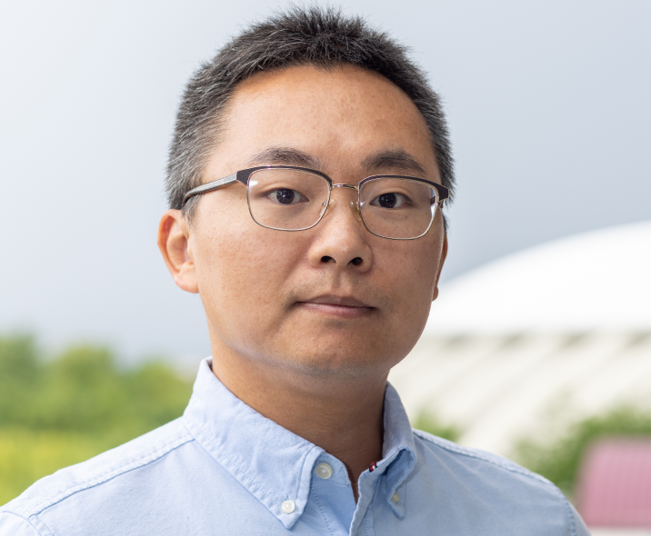

# 2025 Workshop on Interdisciplinary Research on Cyber-Physical Systems: Applications, Security, and Education

## Workshop at a Glance
The workshop aims to inspire and empower CCI researchers interested in Cyber-Physical System applications, cybersecurity, and engineering education to explore new ideas and discuss recent research challenges in the related areas. The workshop strives to foster future collaborations over past work presentations, offering a unique platform for seeding new partnerships and ideas. The event is funded by Commonwealth Cyber Initiative and is open to all researchers and students within [CCI networks](https://cyberinitiative.org/).

The workshop will take place on **`Friday, April 4th, 2025, from 9:00 AM to 1:00 PM`**. Registered participants can attend the workshop in person at the **`Gilbert Place, Room 4001, at Virginia Tech`**.
Registration for this workshop participation is free, underscoring our commitment to inclusivity and knowledge-sharing. We will provide coffee and light refreshments during breaks as well as lunch. Participants are encouraged to make their own arrangements for sustenance, transportation, and accommodations.

## Registration
Please register to attend the workshop [here](https://docs.google.com/forms/d/e/1FAIpQLSe5cdHj8TLBz1V_uehZOWMdS8qpbYalDlOtEXAmT9Z1BCPWGA/viewform?usp=dialog).

## Organizers

<table>
  <tr>
    <td align="center">
      <a href="https://mlsoc.vt.edu/about/faculty-and-staff/xinghua-gao.html">
         
        <strong>Xinghua Gao</strong>
      </a>
    </td>
    <td align="center">
      <a href="https://people.cs.vt.edu/nm8247/">
         
        <strong>Na Meng</strong>
      </a>
    </td>
    <td align="center">
      <a href="https://people.cs.vt.edu/danfeng/">
         
        <strong>Daphne Yao</strong>
      </a>
    </td>
  </tr>
</table>

## Invited Speakers

<table>
  <tr>
    <td align="center">
      <a href="https://engineering.virginia.edu/faculty/lu-feng">
         
        <strong>Lu Feng</strong>
      </a>
    </td>
    <td align="center">
      <a href="https://people.computing.clemson.edu/~lcheng2/">
         
        <strong>Long Cheng</strong>
      </a>
    </td>
    <td align="center">
      <a href="https://ece.vt.edu/people/profile/zeng.html">
         
        <strong>Haibo Zeng</strong>
      </a>
    </td>
  </tr>
</table>

<table>
  <tr>
    <td align="center">
      <a href="https://experts.vt.edu/24861-mengxi-zhang">
         
        <strong>Mengxi Zhang</strong>
      </a>
    </td>
    <td align="center">
      <a href="https://enge.vt.edu/People/instructors-and-pop/benchambers.html">
         
        <strong>Benjamin Chambers</strong>
      </a>
    </td>
    <td align="center">
      <a href="https://www.bse.vt.edu/people/faculty/yiming-feng.html">
         
        <strong>Yiming Feng</strong>
      </a>
    </td>
  </tr>
</table>

## Workshop Schedule
**Date & Time:** Friday, April 4th, 9:00 AM – 1:00 PM

| Time                  | Event                                                                                                                                                                                                                                                            |
|-----------------------|------------------------------------------------------------------------------------------------------------------------------------------------------------------------------------------------------------------------------------------------------------------|
| **9:00 – 9:20 AM**    | **Breakfast**                                                                                                                                                                                                                                                    |
| **9:20 – 9:30 AM**    | **Welcome**                                                                                                                                                                                                                                                      |
| **9:30 – 10:50 AM**   | **First Session** (four presentations)   • Dr. Xinghua Gao   • Dr. Long Cheng   • Dr. Haibo Zeng   • Dr. Mengxi Zhang                                                                                     |
| **10:50 – 11:20 AM**  | **Break**                                                                                                                                                                                                                                                        |
| **11:20 AM – 12:20 PM** | **Second Session** (three presentations)   • Dr. Benjamin Chambers   • Dr. Yiming Feng   • Dr. Lu Feng                                                                                                                                           |
| **12:20 PM**          | **Lunch**                                                                                                                                                                                                                                                        |
| **1:00 PM**           | **Closing Remarks**      

## Sponsor

